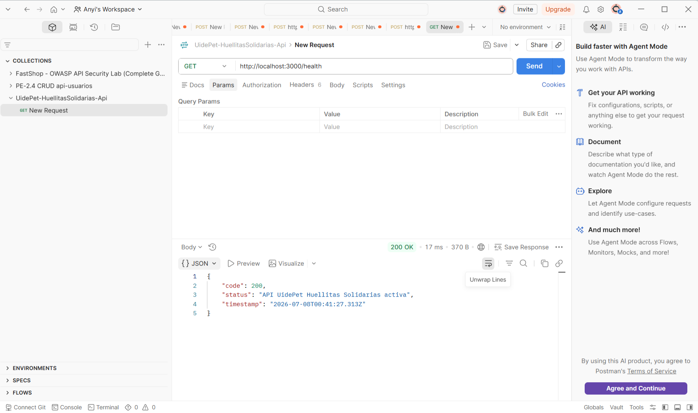
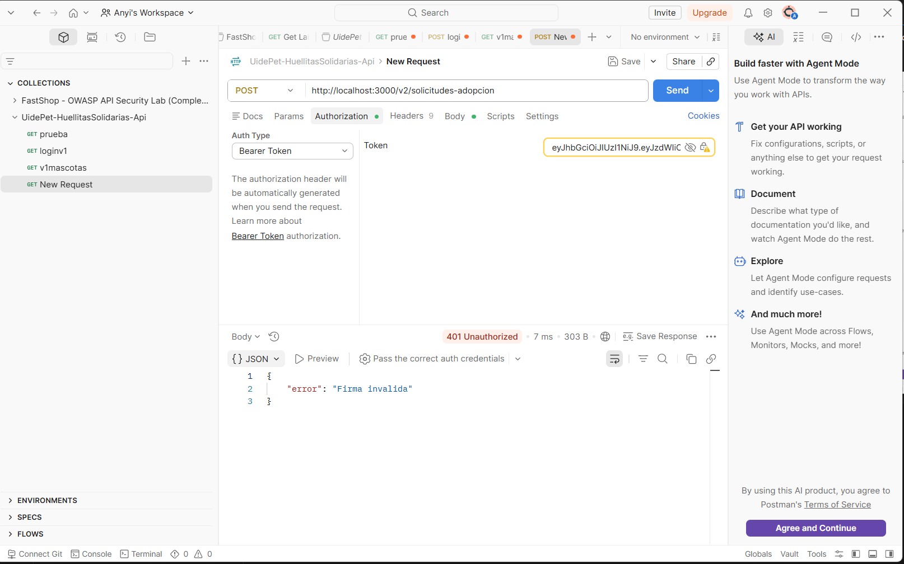

# UidePet - Huellitas Solidarias API

Este repositorio contiene el backend del proyecto **UidePet - Huellitas Solidarias**. Lo desarrolle con **Node.js, Express y TypeScript**, siguiendo la forma de trabajo vista en clases para crear una API con rutas versionadas, middlewares, autenticacion JWT y documentacion OpenAPI.

En este avance se dejaron funcionando rutas de prueba para mascotas y solicitudes de adopcion. Los datos usados son temporales, ya que el objetivo principal fue validar que la API funcione correctamente, que las rutas respondan en Postman y que la autenticacion con JWT proteja los endpoints privados.

## Instalacion

Para instalar las dependencias del proyecto se ejecuta:

```bash
npm install
```

## Variables de entorno

Para que el proyecto funcione se debe crear un archivo `.env` en la raiz del proyecto con estas variables:

```env
PORT=3000
JWT_SECRET=secreto-demo-huellitas
```

Tambien se dejo el archivo `.env.example` como referencia. El archivo `.env` real no se sube al repositorio porque contiene informacion sensible.

## Ejecucion del servidor

Para levantar el backend en modo desarrollo se usa:

```bash
npm run dev
```

El servidor se ejecuta en:

```txt
http://localhost:3000
```

Para comprobar que la API esta activa se puede probar:

```txt
GET http://localhost:3000/health
```

## Token JWT

Las rutas principales estan protegidas con JWT. Para generar un token de prueba se usa el archivo `generate-token.mjs`.

El comando es:

```bash
node generate-token.mjs
```

Luego se copia el token generado y se pega en Postman en la seccion:

```txt
Authorization -> Bearer Token
```

Con esto se pueden probar las rutas protegidas.

## Rutas implementadas

Se implemento la ruta `GET /health`, que permite verificar si el servidor esta funcionando.

Tambien se implemento `GET /v1/mascotas`, que permite listar mascotas disponibles para adopcion.

Ademas, se implemento `POST /v1/solicitudes-adopcion`, que registra una solicitud basica de adopcion.

Finalmente, se agrego `POST /v2/solicitudes-adopcion`, que registra una solicitud de adopcion con informacion adicional para seguimiento.

## Pruebas realizadas en Postman

### Prueba 1: servidor activo

Se probo la ruta:

```txt
GET http://localhost:3000/health
```

La API respondio con estado `200 OK`, confirmando que el servidor estaba funcionando correctamente.



### Prueba 2: solicitud de adopcion con token valido

Se probo la ruta:

```txt
POST http://localhost:3000/v2/solicitudes-adopcion
```

Se envio un token valido en `Authorization -> Bearer Token` y un cuerpo JSON con los datos de la solicitud.

La API respondio con estado `201 Created`, indicando que la solicitud fue registrada correctamente.


### Prueba 3: token con firma invalida

Tambien se probo un token con firma invalida para verificar que la API no acepte tokens alterados.

La respuesta fue `401 Unauthorized`, demostrando que el middleware valida la firma antes de permitir el acceso.



### Prueba 4: token con algoritmo none

Finalmente se probo un token con `alg:none`.

La API rechazo la peticion con `401 Unauthorized`, evitando que se acepte un token sin firma segura.


## Documentacion OpenAPI

Se creo el archivo:

```txt
openapi.yaml
```

En este archivo se documentaron las rutas principales de la API, los cuerpos de solicitud, las respuestas y la seguridad con Bearer Token.

Para validar la documentacion se ejecuto:

```bash
npx @redocly/cli lint openapi.yaml
```

El resultado fue valido:

```txt
Woohoo! Your API description is valid.
```

Solo aparecio un warning por el uso de `localhost`, ya que el servidor esta configurado para entorno local.

## Validacion TypeScript

Tambien se valido el proyecto con:

```bash
npx tsc --noEmit
```

El comando se ejecuto sin errores.

## Estado del avance

Hasta este punto, el backend cuenta con rutas funcionales, rutas versionadas, autenticacion JWT, validacion de tokens, documentacion OpenAPI y evidencias de pruebas realizadas en Postman.


**Dominio del proyecto:** Huellitas Solidarias  
**Sitio web:** http://huellitassolidarias.com


# UidePet - Huellitas Solidarias API

> API REST para gestionar mascotas en adopcion, usuarios autenticados y control de acceso por roles dentro del proyecto Huellitas Solidarias.

**Integrantes:**
- Carpio Anyela
- Soto Jhosty
- Ruiz Yostin

**Curso:** Middleware y Seguridad en Bases de Datos — Semana 10  
**Repositorio:** https://github.com/Anyela0515/uidepet-huellitasSolidarias-Api

---

## Arquitectura

Este proyecto implementa una API REST con arquitectura de 3 capas:

Presentacion -> controllers/ + routes/  
Negocio -> services/  
Datos -> repositories/

La capa de presentacion recibe las peticiones HTTP, valida los datos cuando corresponde y devuelve respuestas al cliente.

La capa de negocio contiene la logica principal del sistema. Por ejemplo, verifica si una mascota existe antes de actualizarla o eliminarla.

La capa de datos es la unica que se comunica directamente con MySQL mediante consultas SQL usando mysql2.

Esta separacion ayuda a que el proyecto sea mas ordenado, facil de mantener y mas claro para trabajar en equipo.

---

## Tecnologias

| Herramienta        | Version | Rol                              |
|--------------------|---------|----------------------------------|
| Node.js            | 22 LTS  | Runtime                          |
| TypeScript         | 5.x     | Tipado estatico                  |
| Express            | 5.x     | Framework HTTP                   |
| MySQL              | 8.x     | Base de datos relacional         |
| mysql2             | 3.x     | Driver MySQL con soporte Promise |
| Zod                | 3.x     | Validacion de esquemas           |
| jsonwebtoken       | 9.x     | Generacion y verificacion de JWT |
| bcryptjs           | 3.x     | Hash de contrasenas              |
| express-rate-limit | 7.x     | Limitacion de solicitudes        |
| tsx                | 4.x     | Ejecucion de TypeScript          |
| OpenAPI            | 3.x     | Documentacion de la API          |
| Postman            | Actual  | Pruebas de endpoints             |
| MySQL Workbench    | 8.x     | Modelo EER                       |

---

## Modelo de datos

El diagrama EER generado desde MySQL Workbench se encuentra en:

`db/modelo-eer.png`

Tambien se incluye el archivo editable de MySQL Workbench:

`db/modelo-eer.mwb`

La base de datos utilizada en el proyecto es:

`huellitas_solidarias_uide`

Algunas tablas principales del modelo son:

- `organizacion`
- `persona`
- `rol`
- `cuenta_usuario`
- `cuenta_rol`
- `mascota`
- `foto_mascota`
- `carnet_vacunacion`
- `solicitud_adopcion`
- `adopcion`
- `seguimiento_adopcion`
- `donacion`

Relaciones principales usadas en esta entrega:

- `organizacion` (1) -> (N) `mascota`
- `cuenta_usuario` (N) -> (N) `rol` mediante `cuenta_rol`
- `persona` (1) -> (N) `cuenta_usuario`
- `mascota` (1) -> (N) `foto_mascota`
- `mascota` (1) -> (N) `solicitud_adopcion`

Para esta fase, el modulo funcional principal es el CRUD de mascotas conectado a la tabla real `mascota`.

---

## Instalacion y ejecucion local

### Requisitos previos

- Node.js 22 LTS
- MySQL 8 corriendo localmente
- Git
- MySQL Workbench opcional para revisar el modelo EER
- Postman para probar los endpoints

---

### 1. Clonar el repositorio

```bash
git clone https://github.com/Anyela0515/uidepet-huellitasSolidarias-Api.git
cd uidepet-huellitasSolidarias-Api
2. Instalar dependencias
npm install
3. Configurar variables de entorno

Crear un archivo .env en la raiz del proyecto tomando como base el archivo .env.example.

Ejemplo de configuracion:

PORT=3000

DB_HOST=localhost
DB_PORT=3306
DB_USER=root
DB_PASSWORD=tu_password_mysql
DB_NAME=huellitas_solidarias_uide

JWT_SECRET=secreto_demo_huellitas_solidarias_minimo_32_caracteres
JWT_EXPIRES_IN=1h

El archivo .env no debe subirse al repositorio, porque puede contener credenciales locales o informacion sensible.

El archivo que si debe subirse es:

.env.example

4. Crear la base de datos y cargar datos

Primero se ejecuta el script de estructura:

mysql -u root -p < db/schema.sql

Luego se ejecuta el script de datos:

mysql -u root -p < db/seed.sql

Los scripts crean la base de datos, las tablas y cargan los registros de prueba necesarios para trabajar con la API.

Usuarios de prueba:

Organizacion / Fundacion:

Email: fundacion@huellitas.com
Password: 123456
Rol: organizacion

Adoptante:

Email: maria.torres@correo.com
Password: 123456
Rol: adoptante

Si se usa PowerShell y el operador < da error, se puede ejecutar con CMD:

cmd /c "mysql -u root -p < db\schema.sql"
cmd /c "mysql -u root -p < db\seed.sql"

Si MySQL no esta agregado al PATH de Windows, se puede usar la ruta completa:

cmd /c """C:\Program Files\MySQL\MySQL Server 8.0\bin\mysql.exe"" -u root -p < db\schema.sql"
cmd /c """C:\Program Files\MySQL\MySQL Server 8.0\bin\mysql.exe"" -u root -p < db\seed.sql"
5. Iniciar el servidor
npm run dev

La API queda disponible en:

http://localhost:3000

Para verificar que el servidor esta activo:

GET http://localhost:3000/health

Respuesta esperada:

{
  "code": 200,
  "status": "API UidePet Huellitas Solidarias activa",
  "timestamp": "2026-07-07T00:00:00.000Z"
}
Como obtener un token JWT

Para usar las rutas protegidas primero se debe iniciar sesion.

Endpoint:

POST /auth/login

URL completa:

http://localhost:3000/auth/login

Body para login con organizacion:

{
  "email": "fundacion@huellitas.com",
  "password": "123456"
}

Respuesta esperada:

{
  "token": "eyJhbGciOiJIUzI1NiIsInR5cCI6IkpXVCJ9...",
  "usuario": {
    "id": 1,
    "nombre": "Fundacion Huellitas Solidarias",
    "email": "fundacion@huellitas.com",
    "rol": "organizacion"
  }
}

Se copia el campo token y se usa en las rutas protegidas asi:

Authorization: Bearer <token>

En Postman se puede colocar en:

Authorization -> Bearer Token
Endpoints
General
Metodo	Ruta	Auth	Descripcion
GET	/health	No	Verifica que la API este activa
Autenticacion
Metodo	Ruta	Auth	Descripcion
POST	/auth/login	No	Inicia sesion y retorna JWT

Body para login:

{
  "email": "fundacion@huellitas.com",
  "password": "123456"
}
Mascotas
Metodo	Ruta	Auth	Rol requerido	Descripcion
GET	/v1/mascotas	Si	Usuario autenticado	Lista todas las mascotas
GET	/v1/mascotas/:id	Si	Usuario autenticado	Obtiene mascota por ID
POST	/v1/mascotas	Si	organizacion/admin	Crea una mascota
PATCH	/v1/mascotas/:id	Si	organizacion/admin	Actualiza una mascota
DELETE	/v1/mascotas/:id	Si	organizacion/admin	Elimina una mascota

Body para crear mascota:

{
  "fk_organizacion_id": 1,
  "nombre": "Estrella",
  "especie": "PERRO",
  "raza": "MESTIZO",
  "sexo": "HEMBRA",
  "edad_aproximada": "1 ano",
  "tamano": "MEDIANO",
  "color": "Blanco con negro",
  "descripcion": "Perrita tranquila, carinosa y lista para adopcion responsable.",
  "historia": "Fue rescatada por la organizacion y recibio atencion basica.",
  "estado_salud": "Vacunada, desparasitada y estable",
  "esterilizado": false,
  "estado_adopcion": "DISPONIBLE"
}
Codigos de respuesta
Codigo	Situacion
200	Operacion exitosa
201	Recurso creado correctamente
204	Recurso eliminado correctamente
400	Datos requeridos faltantes
401	Token no proporcionado, invalido o expirado
403	Rol insuficiente
404	Recurso no encontrado
422	Datos de entrada invalidos por validacion Zod
429	Limite de solicitudes excedido
500	Error interno del servidor
Estructura del proyecto
src/
├── index.ts
├── config/
│   └── database.ts
├── middlewares/
│   ├── auth.ts
│   ├── errorHandler.ts
│   ├── logger.ts
│   └── rateLimiter.ts
├── schemas/
│   └── mascota.schema.ts
├── repositories/
│   └── mascota.repository.ts
├── services/
│   └── mascota.service.ts
├── controllers/
│   └── mascota.controller.ts
└── routes/
    ├── auth.ts
    └── v1/
        ├── mascotas.ts
        ├── solicitudesAdopcion.ts
        └── ../v2/solicitudesAdopcion.ts

db/
├── schema.sql
├── seed.sql
├── modelo-eer.mwb
└── modelo-eer.png

docs/
└── screenshots/
    ├── 01-health-200.png
    ├── 02-login-organizacion-200.png
    ├── 03-mascotas-token-200.png
    ├── 04-mascotas-sin-token-401.png
    ├── 05-adoptante-crear-mascota-403.png
    ├── 06-mascota-zod-422.png
    └── 07-mascota-creada-201.png

openapi.yaml
README.md
.env.example
package.json
Contrato OpenAPI

El archivo openapi.yaml se encuentra en la raiz del proyecto.

Este archivo describe los endpoints, schemas, respuestas y seguridad con Bearer Token.

Para visualizarlo:

Abrir https://editor.swagger.io
Copiar el contenido de openapi.yaml
Pegar el contenido en el editor
Revisar los endpoints documentados

Tambien se valido con Redocly:

npx @redocly/cli lint openapi.yaml

Resultado:

Woohoo! Your API description is valid.

Las advertencias relacionadas con localhost son normales porque la API se ejecuta en entorno local para esta entrega.

Evidencias en Postman

Las capturas estan guardadas en:

docs/screenshots/
Archivo	Evidencia
01-health-200.png	Servidor activo con respuesta 200
02-login-organizacion-200.png	Login correcto con rol organizacion
03-mascotas-token-200.png	Listado de mascotas con token valido
04-mascotas-sin-token-401.png	Bloqueo por token ausente
05-adoptante-crear-mascota-403.png	Bloqueo por rol insuficiente
06-mascota-zod-422.png	Error de validacion con Zod
07-mascota-creada-201.png	Mascota creada correctamente
Decisiones de diseno
Por que arquitectura de 3 capas

Se uso arquitectura de 3 capas para separar responsabilidades.

Los controllers reciben la peticion HTTP y responden al cliente.
Los services contienen la logica de negocio.
Los repositories son los unicos que ejecutan SQL.

Esto evita mezclar Express con consultas SQL y permite mantener el proyecto mas limpio.

Por que JWT

Se uso JWT para proteger rutas privadas sin manejar sesiones en el servidor.

Cuando el usuario inicia sesion, la API genera un token con informacion basica como id, email y rol. Luego ese token se envia en cada peticion protegida.

Por que roles

No todos los usuarios tienen los mismos permisos.

Un usuario con rol organizacion puede crear, actualizar y eliminar mascotas.

Un usuario con rol adoptante puede iniciar sesion, pero no puede crear mascotas. Si intenta hacerlo, la API responde con codigo 403.

Por que Zod para validacion

Zod permite definir el contrato de entrada directamente en TypeScript.

Si el body no cumple el schema, la API responde con codigo 422 y muestra el detalle de los campos invalidos.

Ejemplo: si se envia una especie no permitida como HAMSTER, la validacion falla porque las especies aceptadas son:

PERRO
GATO
CONEJO
OTRO
Por que bcryptjs

Las contrasenas no deben manejarse como texto plano.

Por eso se usa bcryptjs para comparar la contrasena ingresada con el hash guardado en la base de datos.

Por que rate limiting

Se implemento rate limiting para limitar la cantidad de solicitudes que puede hacer un cliente en un periodo de tiempo.

Esto ayuda a proteger la API contra abuso o exceso de peticiones.

Por que JOIN en el repository

El repository de mascotas usa un JOIN entre mascota y organizacion.

Esto permite obtener los datos de la mascota junto con el nombre de la organizacion en una sola consulta, evitando hacer consultas separadas innecesarias.

Comandos utiles

Validar TypeScript:

npx tsc --noEmit

Ejecutar servidor:

npm run dev

Validar OpenAPI:

npx @redocly/cli lint openapi.yaml

Ver estado de Git:

git status

Subir cambios:

git add .
git commit -m "feat: entrega api huellitas fase I"
git push
Estado final del proyecto

La API queda funcional con base de datos MySQL real, arquitectura de 3 capas, CRUD de mascotas, autenticacion JWT, autorizacion por roles, validacion con Zod, rate limiting, contrato OpenAPI valido, evidencias en Postman y modelo EER generado desde MySQL Workbench.